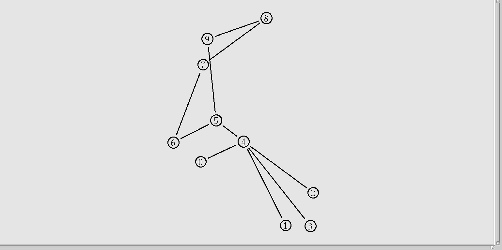

# پروژه درس شبکه 
### امیررضا الستی - 9812762485

#### 1. کانفیگ اولیه پروژه

ابتدا یک سیمولاتور ایجاد میکنیم و سپس یک فایل نم و یک فایل تریسکیشن ایجاد میکنیم

    set ns [new Simulator]
    set nf [open out.nam w]
    set tf [open out.tr w]
    $ns namtrace-all $nf
    $ns trace-all $tf
    $ns color blue

#### 2. تعریف نود ها

حال نه نود ایجاد میکنیم که از صفر تا نه هستند

    set n0 [$ns node]
    set n1 [$ns node]
    set n2 [$ns node]
    set n3 [$ns node]
    set n4 [$ns node]
    set n5 [$ns node]
    set n6 [$ns node]
    set n7 [$ns node]
    set n8 [$ns node]
    set n9 [$ns node]

میتوانستیم از حلقه هم به شکل زیر استفاده کنیم

    for {set i 0} {$i < 10} {incr i} {
        set n$i [$ns node]
    }

#### 3. تعریف لینک ها

حال لینک ها را تعریف میکنیم

    $ns duplex-link $n0 $n4 10Mb 2ms DropTail orient right
    $ns duplex-link $n1 $n4 10Mb 2ms DropTail orient right
    $ns duplex-link $n2 $n4 10Mb 2ms DropTail orient right
    $ns duplex-link $n3 $n4 10Mb 2ms DropTail orient right
    $ns simplex-link $n4 $n5 300Kbps 100ms DropTail right
    $ns simplex-link $n5 $n4 300Kbps 100ms DropTail left
    $ns duplex-link $n5 $n6 500Kbps 40ms DropTail orient left
    $ns duplex-link $n5 $n9 500Kbps 40ms DropTail orient left
    $ns duplex-link $n6 $n7 500Kbps 40ms DropTail orient left
    $ns duplex-link $n7 $n8 500Kbps 40ms DropTail orient left
    $ns duplex-link $n8 $n9 500Kbps 40ms DropTail orient left

##### داپلس لینک چیست؟ داپلس لینک یک لینک دو طرفه است که از یک نود به یک نود متصل میشود
##### سیمپلکس لینک چیست؟ سینکس لینک یک لینک یک طرفه است که از یک نود به یک نود متصل میشود

همچنین ترافیک هر لینک را میتوان با استفاده از یک مقدار بر حسب بیت در ثانیه تعریف کرد

#### 4. کانفیگ tcp

تی سی پی ایجنت را ایجاد میکنیم و آن را به نود اول متصل میکنیم

    set tcp0 [new Agent/TCP/Reno]
    $ns attach-agent $n1 $tcp0

تی سی پی سینک را ایجاد میکنیم و آن را به نود نه متصل میکنیم

    set sink0 [new Agent/TCPSink]
    $ns attach-agent $n9 $sink0

سپس این دو را به هم متصل میکنیم

        $ns connect $tcp0 $sink0

#### 5. کانفیگ ftp

    set ftp0 [new Application/FTP]
    $ftp0 attach-agent $tcp0

در نظر داریم که پروتوکول انتقال فایل از پروتوکول تی سی پی استفاده میکند

#### 6. کانفیگ زمانی

مطابق پروژه اتصال بین گره هفتم و هشتم از ثانیه دوم تا چهارم قطع میشود

    $ns rtmodel-at 2.0 down $n7 $n8
    $ns rtmodel-at 4.0 up $n8 $n7

کد زیر هم برای زمان شروع و پایان پروتوکول انتقال فایل میباشد 

    $ns at 0.3 "$ftp start"
    $ns at 10.0 "$ftp stop"
    
#### 7. اجرای مدل

با دستوارت زیر مدل را اجرا میکنیم

    $ns run

#### 8. نحوه اجرا
در ترمینال دستورات زیر را وارد میکنیم

    ns project.tcl
    nam out.nam

#### 9. عکس نتیجه اجرا

##### عکس های نتیجه اجرای مدل به صورت زیر هستند
* simulationImage1.png
* simulationImage2.png
* simulationVideo.webm

##### این گزارش نیز با زبان مارک داون نوشته شده است 

### در اخر توضیحاتی درباره زبان تی سی ال

زبان تی سی ال یک زبان برنامه نویسی است که برای مدل سازی شبکه های کامپیوتری توسط شرکت اپل توسعه داده شده است

### پروتوکول های مدل سازی شده
* TCP (Transmission Control Protocol)
* FTP (File Transfer Protocol)